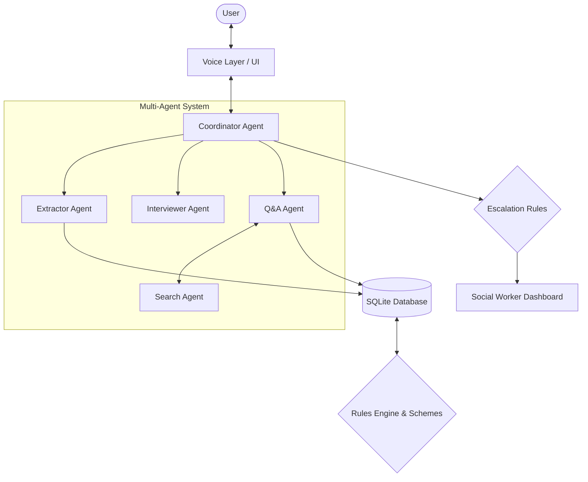

# Sahaya / സഹായ
> A voice-first AI agent that helps persons with disabilities in Kerala discover and apply for the benefits they're entitled to.


<!-- Add demo GIF here -->

**[Live Demo](#)** | **[Demo Video](#)** | **[Pitch Deck](#)**

## Table of Contents
- [Overview](#overview)
- [The Problem](#the-problem)
- [Our Solution](#our-solution)
- [What Makes Sahaya Different](#what-makes-sahaya-different)
- [Who It's For](#who-its-for)
- [Why This Project Matters](#why-this-project-matters)
- [Architecture](#architecture)
- [Tech Stack](#tech-stack)
- [Key Features](#key-features)
- [Getting Started](#getting-started)
- [Project Structure](#project-structure)
- [Testing](#testing)
- [Accessibility](#accessibility)
- [Responsible AI, Safety & Privacy](#responsible-ai-safety--privacy)
- [Data Disclaimer](#data-disclaimer)
- [Roadmap](#roadmap)
- [Team](#team)
- [Acknowledgements](#acknowledgements)
- [License](#license)

## Overview
Sahaya is an accessible, voice-first AI assistant designed to bridge the information gap for persons with disabilities in Kerala. It conducts conversational interviews to understand a user's profile and matches them with eligible government schemes based on codified rules. By explaining complex requirements simply and offering human-in-the-loop escalation, Sahaya ensures users receive accurate, actionable guidance with dignity.

## The Problem
Persons with disabilities frequently miss out on benefits they are legally entitled to due to significant systemic barriers. Application forms are complex, information is often buried in official English documents, and government portals are frequently inaccessible to screen readers or those with cognitive disabilities. Without clear information on eligibility criteria and required documents, many are forced to depend on middlemen, compromising their independence and privacy.

**User Story:** 
> *Amina is a 45-year-old visually impaired woman from rural Kerala.* (Note: Fictional persona from our synthetic dataset). *She needs a UDID card but struggles to navigate the English-only online portal with her screen reader. She is unsure if her 40% disability qualifies her or what documents to upload, and she is hesitant to share her personal details with a local agent.*

**Our Problem Statement:**
> "How might we empower persons with disabilities to independently discover and understand government schemes they are eligible for, overcoming language, accessibility, and bureaucratic barriers?" [VERIFY]

## Our Solution
Sahaya guides users through a clear, accessible process:
1. **Speak:** The user talks to Sahaya in Malayalam, English, or Manglish.
2. **Interview:** Sahaya gently asks questions to build a profile (age, income, disability percentage).
3. **Eligibility with Citations:** The system checks verified rules and explains eligibility, citing official guidelines.
4. **Documents Checklist:** Sahaya lists the exact documents needed for the eligible schemes.
5. **Filled Form:** *(Planned)* The agent assists in auto-filling the required application forms.
6. **Read-back and Confirmation:** *(Planned)* Sahaya reads back the collected information for final approval.
7. **Social Worker Handoff:** For ambiguous or complex cases, Sahaya smoothly hands off the full transcript to a human social worker.

## What Makes Sahaya Different
- **Voice-first in Malayalam, English, and Manglish:** Built to understand local languages and mixed dialects naturally.
- **Usable with eyes closed:** Supports voice commands, audio sound cues, and a dedicated screen reader mode.
- **"Rules decide, AI explains":** Eligibility is determined strictly by a deterministic rule engine (`schemes.json`), never by an AI's guess.
- **Every decision cites the official guideline clause:** When Sahaya answers a question, it points directly to the source document and section.
- **Human-in-the-loop:** The system flags unclear cases or direct user requests and routes them to a social worker dashboard with the full conversation history.
- **Privacy by design:** Explicit consent is gathered upfront, and the system handles sensitive data respectfully without exposing real identifiers (using masked IDs).

## Who It's For
- **Persons with disabilities and their families:** Gain independent access to entitlements without relying on third parties.
- **Social Workers:** Save time on initial data collection and focus on complex cases that require human empathy and intervention.
- **Akshaya Centres & Panchayat Offices:** Streamline the application process and reduce queues by having citizens pre-screened.
- **NGOs:** Scale their outreach efforts and ensure consistent, accurate information dissemination.

## Why This Project Matters
Navigating government bureaucracy should not be a test of endurance. By breaking down language barriers and making information fully accessible, Sahaya restores dignity and independence. It ensures that entitlements reach the people who need them most, empowering the disabled community in Kerala to claim their rightful benefits securely and confidently.

## Architecture



### Agents
| Agent | Job | Model Used | Tools |
|---|---|---|---|
| **Coordinator** | Orchestrates the conversation, detects user intent, and routes to the right agent or human. | Claude 3.5 Haiku | Agent Routing |
| **Extractor** | Silently extracts structured user profile data (age, income, etc.) from the conversation transcript. | Claude 3.5 Haiku | JSON output parsing |
| **Interviewer** | Asks friendly, targeted questions to fill missing required fields for eligibility checks. | Claude 3.5 Haiku | None |
| **Q&A Agent** | Answers factual questions about schemes and rules using verified guidelines. | Claude 3.5 Haiku | Search Agent |
| **Search** | Retrieves relevant clauses and criteria from the rules database based on queries. | Claude 3.5 Haiku | Rules Database Query |

## Tech Stack
| Layer | Technologies | Why we chose it |
|---|---|---|
| **Frontend** | Next.js 16, React 19, TailwindCSS 4 | Fast, server-rendered React components with an accessible UI framework. |
| **AI Models** | Anthropic Claude 3.5 Haiku | High speed, cost-effective, and excellent at following strict JSON and extraction rules. |
| **Data & Storage** | Better-SQLite3, Local JSON (`schemes.json`) | Lightweight, zero-config local database perfect for prototyping and deterministic rules. |
| **Voice** | Web Speech API (via custom hooks) | Native browser support for speech-to-text and text-to-speech capabilities. |
| **Testing** | Node.js TSX (Custom QA Scripts) | Fast execution of automated Q&A tests against synthetic personas. |

## Key Features
- **Conversational Profiling:** Naturally extracts user details through chat instead of long forms.
- **Deterministic Eligibility:** Uses hardcoded logic (e.g., `operator: "gte", value: 40`) for absolute accuracy.
- **Multilingual Voice Interface:** Speak naturally in Malayalam, English, or Manglish.
- **Accessibility Modes:** Toggle between a standard voice mode and a specialized screen reader mode.
- **Seamless Human Escalation:** Automatically routes users to a social worker when confused or requested.
- **Citation-Backed Answers:** Q&A responses are explicitly linked to source documents.

## Getting Started

### Prerequisites
- Node.js (v20 or higher)
- npm or yarn

### Installation
1. Clone the repository:
   ```bash
   git clone <your-repo-url>
   cd amrita-hackathon
   ```
2. Install dependencies:
   ```bash
   npm install
   ```

### Environment Variables
<details>
<summary>Click to view setup instructions</summary>

Create a file named `.env` in the root directory based on `.env.example`:
```bash
cp .env.example .env
```
Add the following variable:
- `ANTHROPIC_API_KEY`: Your secret API key from Anthropic to power the Claude models. (Do not share this).
</details>

### Running the App
Start the development server:
```bash
npm run dev
```
Open [http://localhost:3000](http://localhost:3000) in your browser.

**Available Pages:**
- `/` - The main voice-first chat interface for end users.
- `/worker` - The dashboard for social workers to review escalated cases.

## Project Structure
- `src/agents/` - The multi-agent system logic (Coordinator, Extractor, Interviewer, etc.).
- `src/app/` - Next.js frontend pages and API routes.
- `src/db/` - SQLite database initialization and queries.
- `src/hooks/` - Custom React hooks (e.g., `useSpeech`).
- `data/` - Static rules (`schemes.json`, `user_profile_fields.json`).
- `data/synthetic/` - Fictional personas and mock official guidelines.
- `tests/` - Evaluation scripts for agent accuracy.

## Testing
We maintain automated tests to verify the Q&A agent's accuracy and fallback mechanisms across languages.
To run the QA tests against our synthetic cases:
```bash
npx tsx tests/qa_test.ts
```
This script tests whether the agent correctly answers factual queries and appropriately escalates unanswerable questions (e.g., "Do I get a free laptop?") to a human.

## Accessibility
Accessibility is built-in from day one:
- **Voice & Screen Reader Modes:** Users are greeted with an auditory prompt to select their preferred mode (Voice Mode or Screen Reader Mode).
- **Keyboard Navigation:** Designed to be navigable without a mouse.
- **Audio Cues:** Distinct sounds for success, error, and listening states.

## Responsible AI, Safety & Privacy
- **Rules-Based Eligibility:** AI is strictly forbidden from guessing eligibility; it only explains the deterministic results from `schemes.json`.
- **Citations:** Every factual claim is tied to a specific guideline clause.
- **Escalation:** The system proactively connects users to a human when it detects confusion, complex medical severity flags, or direct requests.
- **Consent & Privacy:** Explicit consent is requested before data collection, and sensitive details are mapped using masked IDs.
- **Synthetic Data:** All testing is conducted using entirely synthetic personas and mock guidelines to protect real user data.
- **Known Limitations:** The system may struggle with heavy background noise in voice transcription and currently relies on a limited set of digitized schemes.

> [!IMPORTANT]
> **Data Disclaimer** 
> All personas, cases, and demo guidelines in the `data/synthetic/` directory are completely synthetic and fictional. The demo guidelines must be replaced with official, legally verified documents before real-world use. Sahaya is a tool for information discovery and does not replace official government decisions or medical assessments.

## Roadmap
- [ ] **Auditor Agent:** Implement a final validation agent that checks all responses before they reach the user.
- [ ] **Filled Form Generation:** Auto-fill and generate PDF applications based on extracted profiles.
- [ ] **More Schemes & Languages:** Expand the database to include all state and central schemes and add support for Tamil and Hindi.
- [ ] **Offline Open-Source Model:** Transition from cloud APIs to a localized, offline model for enhanced privacy and rural accessibility.
- [ ] **RAG Q&A:** Enhance the search agent with advanced Retrieval-Augmented Generation for massive document libraries.
- [ ] **Official Portal Integration:** Direct API integration with government portals for direct submissions.

## Team
| Name | Role | GitHub |
|---|---|---|
| [Toka Nani] | [Frontend Developer] | [@naniToka] |
| [Placeholder Name] | [Placeholder Role] | [@placeholder](#) |

## Acknowledgements
- Built for [Placeholder Hackathon Name].
- Powered by [Anthropic Claude](https://www.anthropic.com/), [Next.js](https://nextjs.org/), and [TailwindCSS](https://tailwindcss.com/).

## License
Currently unlicensed. (An MIT License is suggested. Please confirm before adding a LICENSE file).
